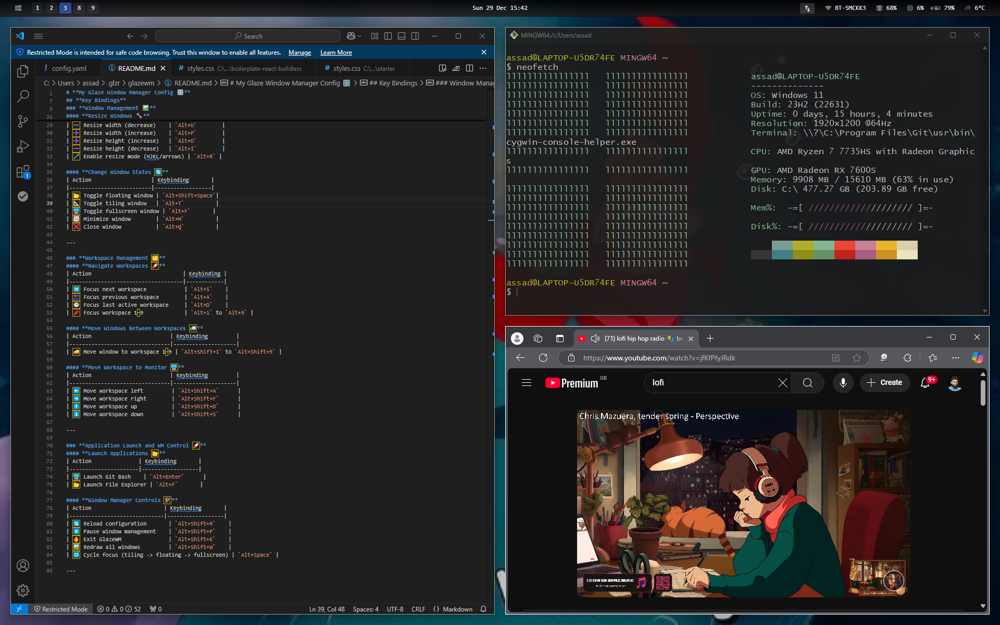

# **My Glaze Window Manager Config 🎛️**

Welcome to my **GlazeWM** configuration! [GlazeWM](https://github.com/glzr-io/glazewm) is a powerful tiling window manager for Windows. This repository contains my customised configuration file.

---

## **Key Bindings**

### **Window Management 🖼️**
#### **Focus Windows 👁️**
| Action               | Keybinding          |
|----------------------|---------------------|
| 🔄 Focus window left  | `Alt+H`, `Alt+Left` |
| 🔄 Focus window right | `Alt+L`, `Alt+Right`|
| 🔄 Focus window up    | `Alt+K`, `Alt+Up`   |
| 🔄 Focus window down  | `Alt+J`, `Alt+Down` |

#### **Move Windows 🏃**
| Action               | Keybinding              |
|----------------------|-------------------------|
| ↔️ Move window left   | `Alt+Shift+H`, `Alt+Shift+Left` |
| ↔️ Move window right  | `Alt+Shift+L`, `Alt+Shift+Right`|
| ↕️ Move window up     | `Alt+Shift+K`, `Alt+Shift+Up`   |
| ↕️ Move window down   | `Alt+Shift+J`, `Alt+Shift+Down` |

#### **Resize Windows 🔧**
| Action                       | Keybinding     |
|------------------------------|----------------|
| ➖ Resize width (decrease)    | `Alt+U`        |
| ➕ Resize width (increase)    | `Alt+P`        |
| ➕ Resize height (increase)   | `Alt+O`        |
| ➖ Resize height (decrease)   | `Alt+I`        |
| 🖋️ Enable resize mode (HJKL/arrows) | `Alt+R` |

#### **Change Window States 🔄**
| Action                   | Keybinding       |
|--------------------------|------------------|
| 📂 Toggle floating window | `Alt+Shift+Space`|
| 📐 Toggle tiling window   | `Alt+T`          |
| 🖥️ Toggle fullscreen window | `Alt+F`       |
| 📉 Minimize window        | `Alt+M`          |
| ❌ Close window           | `Alt+Q`          |

---

### **Workspace Management 🗂️**
#### **Navigate Workspaces 🚀**
| Action                             | Keybinding |
|------------------------------------|------------|
| 🔀 Focus next workspace            | `Alt+S`    |
| 🔙 Focus previous workspace        | `Alt+A`    |
| 🕑 Focus last active workspace     | `Alt+D`    |
| 📌 Focus workspace 1–9             | `Alt+1` to `Alt+9` |

#### **Move Windows Between Workspaces 🚛**
| Action                         | Keybinding         |
|--------------------------------|--------------------|
| 🚚 Move window to workspace 1–9 | `Alt+Shift+1` to `Alt+Shift+9` |

#### **Move Workspace to Monitor 🖥️**
| Action                         | Keybinding         |
|--------------------------------|--------------------|
| ⬅️ Move workspace left         | `Alt+Shift+A`      |
| ➡️ Move workspace right        | `Alt+Shift+F`      |
| ⬆️ Move workspace up           | `Alt+Shift+D`      |
| ⬇️ Move workspace down         | `Alt+Shift+S`      |

---

### **Application Launch and WM Control 🚀**
#### **Launch Applications 📂**
| Action               | Keybinding       |
|----------------------|------------------|
| 🖥️ Launch Git Bash    | `Alt+Enter`      |
| 📂 Launch File Explorer | `Alt+F`       |

#### **Window Manager Controls 🛠️**
| Action                       | Keybinding       |
|------------------------------|------------------|
| 🔄 Reload configuration       | `Alt+Shift+R`    |
| ⏸️ Pause window management    | `Alt+Shift+P`    |
| 🔥 Exit GlazeWM               | `Alt+Shift+E`    |
| 🖼️ Redraw all windows         | `Alt+Shift+W`    |
| 🔁 Cycle focus (tiling -> floating -> fullscreen) | `Alt+Space` |

---